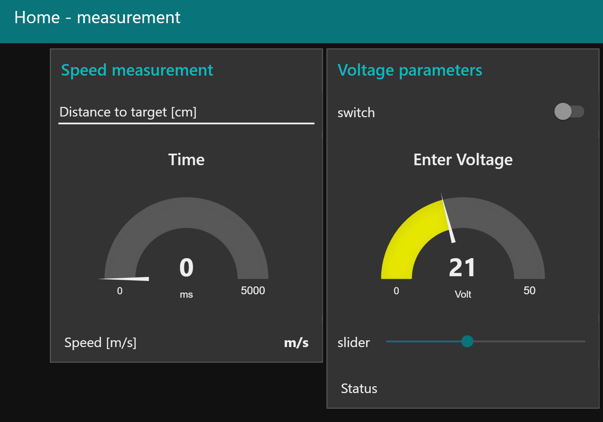

# Project_Embedded_System-Coilgun
## introduction
This Coilgun project is a project 
The purpose of this project was to make a school laboratory experience which could be actionned remotely from the student's home. It was demanded to use atleast 2 of 3 following : 
- arduino
- Beagle Bone Black
- PIC

We choose the arduino and the BBB. The arduino will be connected the coilgun electronic circuit, to a proximity sensor and a bouton. The type of connection we chooses to connect the arduino to the BBB is through uart and finally by MQTT we choose to connect the BBB with the Node-RED interface. 

## SETUP
### arduino
One of the things we wanted to measure was the speed of the projectile. To do that we took a proximity sensor and a push button. In the arduino code, a first variable is activated when the projectile passes the sensor and a counter starts, then only if that variable is activated, it listen to the pin connected to the button and when pushed (projectile has reached target), counter stops and this time is send through uart to the BBB. The pins of the arduino connected to the buttons can be read in the code, same as the RX and TX port for the uart connection, pin 10 and 11 respectively.
When everything is setup upload the arduino file into your arduino board.
### Beagle Bone black
The arduino is connected via uart to the UART1 of the BBB, p9.24 and p9.26, TX and RX respectively. One more cable is needed to connect the arduino and BBB on the same GND. 
When everything is setup, you will need to upload the files read and write into the BBB (easy way : use filezila, connect `sftp://<IpAdress>`, username and password).
Open then 2 bash terminals and connect to your BBB on each of them. Again on each of those terminals enter the following commands
```
config-pin p9.24 uart
config-pin p9.24 uart
stty -F /dev/ttyO1 sane
```
After that just run the two python scripts running the following commands : 
```
python readuart_Arduin-BBB-Dash.py
```
and 
```
python writeUart_Dash-BBB-Arduino.py
```
The readuart script retrieves data send by the arduino in the form of a string, this string is then decomposed by means of a letter describing which data it is and in function of that publish the value in right topic generated by the Node-RED interface. 
The write uart retrieves data from a topic of the Node-RED interface he is subscribed to and send this data through uart to the arduino board.
### Node-RED
You need to start from your command prompt node-red and go to the following pair `<IP:port>` in your browser `localhost:1880`
After that you can download the flow for the Node-RED dashboard in JSON form. This can be done by clicking on the dropdown in the upper right corner and choosing import from clipboard. After that you can go to the dashboard by going to `http://localhost:1880/ui`.
You should arrive to a dashboard looking like this : 

